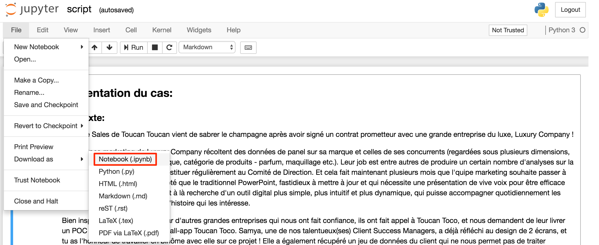

# Toucan Toco - Case Study - Data Analyst 

This repository contains all you need to work on the technical test when applying for data analysts positions.

The technical tests consists of following steps below

### 1. Access to your working environment

To start your work, you can click on the following link : 
.

You will access to a platform which set up all the environment  you need to perform your technical test (don't worry, it might takes a long time to load because Binder is installing the env with python3 and some standard librairies like numpy and pandas).

If you got issues using Binder, you can still download the working documents and work locally on your computer but don't hesitate to reach us.

### 2. Ouverture du fichier de travail

When Binder environment finish to load, you will access to a Jupyter home page with all directories and files for this repository.

Depend on the job offer you apply to

Une fois le chargement de l'environnement Binder terminé, tu arrives sur une page Jupyter où tu retrouves la liste des dossiers et fichiers de ce repository.
Tu peux cliquer sur le fichier "script.ipynb" comme montré ci-dessous:

Toutes les consignes du cas sont disponibles dans ce notebook et tu peux directement coder dans ce dernier !

> **ATTENTION: Binder est un environnement "jetable", c'est-à-dire que si tu quittes Binder sans avoir téléchargé ton notebook, ton travail est perdu. Nous te conseillons de garder ta session Binder ouverte jusqu'à ce que ton travail soit terminé, et de prendre la précaution de télécharger ton notebook régulièrement pour sauvegarder ton travail. Pour cela tu peux suivre la procédure décrite à l'étape 3.**

Si jamais tu as été forcé de quitter Binder et que tu souhaites rouvrir une session pour reprendre ton travail (à condition que tu aies bien une sauvegarde de ton notebook), tu peux refaire l'étape 1 et suivre la procédure décrite à l'étape 3.bis.

### 3. Téléchargement du notebook sur ton ordinateur

Pour cela il te suffit de clicker sur "File" > "Download as" > "Notebook" comme montré ci-dessous:

### 3bis. Ouvrir un notebook enregistré sur ton ordinateur dans Binder

Une fois sur la page d'accueil de Jupyter dans Binder (suite à l'étape 1), tu peux ouvrir un notebook venant de ton ordinateur en cliquant sur "Upload" en haut à droite de l'écran, comme montré ci-dessous sur l'image ci-dessous. Tu seras invité à aller chercher le notebook sur ton ordinateur. Si tu as gardé le même nom de fichier que celui déjà présent par défaut, on te demandera si tu souhaites bien écraser le fichier. Tu peux confirmer.

### 4. Quand tu as terminé ton travail et que tu souhaites nous le soumettre

Quand tu as fini, il faut que tu télécharges le notebook final comme décrit à l'étape 3.
Tu peux ensuite nous l'envoyer à l'adresse yanni.iyeze@toucantoco.com

Bon courage et n'hésite pas à nous contacter si tu as des questions.
